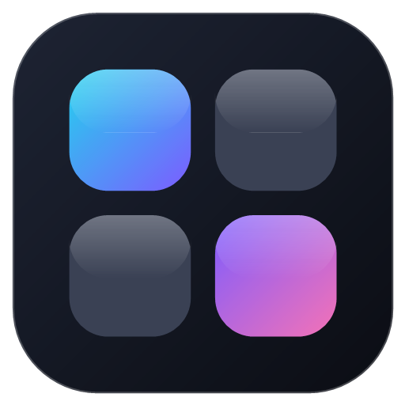

# NumDeck

**Transformez votre pavé numérique en Stream Deck personnalisable.**

NumDeck est une application Windows qui détourne le pavé numérique de votre clavier
pour en faire un véritable Stream Deck : appuyez sur la touche `+` et les touches
`0`–`9`, `.`, `/`, `*` deviennent des boutons d'action entièrement configurables —
scènes OBS, lancement d'applications, raccourcis clavier, sons, sites web…
Ré-appuyez sur `+` et votre pavé numérique redevient parfaitement normal.



## Fonctionnement

| Touche | Rôle quand le deck est actif |
|---|---|
| `+` | Active / désactive le mode deck (fonctionne toujours) |
| `−` | Passe au preset suivant |
| `0`–`9`, `.`, `/`, `*` | 13 boutons d'action configurables |

Quand le mode deck est **actif**, ces touches sont interceptées au niveau système :
elles déclenchent vos actions sans être transmises aux autres applications (jeu,
navigateur, etc.). Quand il est **inactif**, le pavé numérique fonctionne normalement.

Un **OSD** (affichage à l'écran) confirme l'activation, les changements de preset
et les actions déclenchées — pratique en plein jeu ou en stream.

## Fonctionnalités

- **13 boutons** par preset, **presets illimités** (Stream, Musique, Travail…)
- **3 gestes par touche** : appui simple, **double appui** et **appui long**,
  chacun avec sa propre action
- **Overlay** : mini-deck affiché par-dessus toutes les fenêtres (jeu compris) —
  montre l'état du deck, le preset actif et les touches qui s'illuminent à
  l'appui. Déplaçable, puis verrouillable (les clics passent au travers ;
  déverrouillage via la zone de notification ou les paramètres)
- **Affichages en direct sur les touches** : horloge, date, CPU %, RAM %,
  état OBS (● REC / LIVE)
- **Personnalisation totale** de chaque touche : nom, image ou **GIF animé**,
  couleur d'accent — esthétique « touches en verre » façon Stream Deck
- **Intégration OBS Studio** (WebSocket v5, OBS 28+) :
  changement de scène, transition studio, start/stop du stream et de
  l'enregistrement, muet sur une source audio
- **Actions système** : ouvrir une application, un fichier/dossier ou un site web,
  exécuter une commande, envoyer un raccourci clavier (`Ctrl+Shift+F5`…),
  taper un texte, contrôles média (lecture/pause, volume…), jouer un son (soundboard)
- **Glisser-déposer** une image directement sur une touche
- Vit dans la **zone de notification**, lancement possible au démarrage de Windows
- Configuration sauvegardée automatiquement (`%APPDATA%/numdeck/config.json`)

## Connexion à OBS

1. Dans OBS : **Outils → Paramètres du serveur WebSocket → Activer** (OBS 28+)
2. Dans NumDeck : **⚙ Paramètres → OBS Studio**, renseignez le port (4455 par
   défaut) et le mot de passe affiché par OBS, puis **Se connecter**.
3. La pastille « OBS » passe au vert. Les listes de scènes et de sources se
   remplissent alors automatiquement dans l'éditeur de touche.

## Mises à jour automatiques

NumDeck vérifie au lancement (puis toutes les 4 h) si une nouvelle version est
disponible sur **GitHub Releases** — aucun serveur à payer. Si oui, un bandeau
propose de télécharger puis d'installer la mise à jour (téléchargement
différentiel : seuls les morceaux modifiés sont récupérés).

### Configuration (une seule fois)

1. Créer un compte GitHub (gratuit) et un dépôt **public**, par ex. `numdeck`.
2. Dans `package.json` → `build.publish`, remplacer `TON-PSEUDO-GITHUB` par
   votre nom d'utilisateur GitHub.
3. Recompiler et distribuer cet installeur aux utilisateurs.

### Publier une nouvelle version

1. Augmenter `version` dans `package.json` (ex. `1.2.0` → `1.3.0`).
2. `npm run dist`, puis sur GitHub : **Releases → New release**, tag `v1.3.0`,
   et y joindre **3 fichiers** depuis `dist/` :
   `NumDeck-Setup-1.3.0.exe`, `NumDeck-Setup-1.3.0.exe.blockmap` et `latest.yml`.
3. Publier la release. Tous les utilisateurs verront le bandeau de mise à jour
   au prochain lancement.

(Alternative automatisée : `set GH_TOKEN=...` puis `npm run release` — publie
la release directement.)

## Développement

```bash
npm install        # dépendances (Electron, obs-websocket-js…)
npm start          # lance l'application en mode développement
npm run dist       # construit l'installeur Windows (dist/NumDeck-Setup-x.y.z.exe)
```

- `node scripts/preview-server.js` : prévisualise l'interface dans un navigateur
  (avec données factices, sans Electron).
- `powershell -File scripts/make-icons.ps1` : régénère les icônes de l'application.

### Architecture

```
src/
├── main/            Processus principal Electron
│   ├── main.js      Fenêtres, tray, IPC, cycle de vie
│   ├── shortcuts.js Capture globale du pavé numérique
│   ├── actions.js   Exécution des actions (apps, raccourcis, médias…)
│   ├── obs.js       Client OBS WebSocket (reconnexion auto, état stream/rec)
│   ├── config.js    Persistance de la configuration et des presets
│   ├── overlay.js   Fenêtre overlay (mini-deck épinglé)
│   └── osd.js       Fenêtre OSD flottante
├── preload.js       Pont sécurisé main ↔ interface (contextBridge)
└── renderer/        Interface (HTML/CSS/JS, sans framework)
```

## Limitations connues

- L'envoi de raccourcis ne supporte pas la touche `Win` (limite de SendKeys).
- L'interception des touches repose sur les raccourcis globaux de Windows : si une
  autre application a déjà réservé une touche du pavé numérique, NumDeck ne pourra
  pas la capturer.
- Certains jeux en plein écran exclusif peuvent masquer l'OSD.
